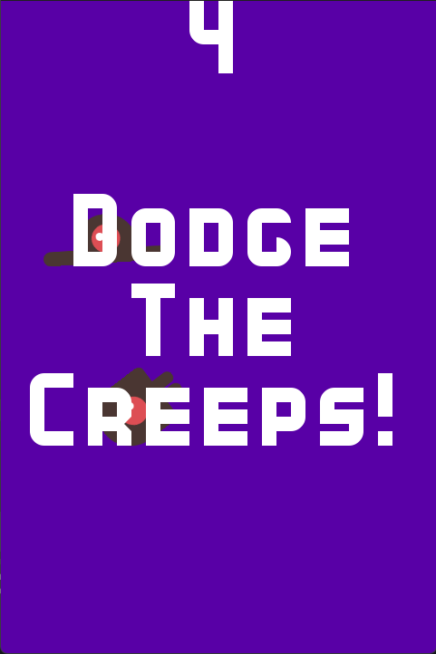

# Dodge The Creeps - Godot 4.2

This is the game that you build from the [Godot Docs](https://docs.godotengine.org) called "[Your first 2D game](https://docs.godotengine.org/en/stable/getting_started/first_2d_game/index.html)". It's titled "Dodge the Creeps" and the object of the game is to move around the screen using WASD to evade the "creeps" as long as possible. 

## Tools Used

- Godot Engine

## Assets Used

- [Kenney Bold](https://www.kenney.nl/assets/kenney-fonts)
- [Dodge The Creeps Assests from Godot Docs](https://github.com/godotengine/godot-docs-project-starters/releases/download/latest-4.x/dodge_the_creeps_2d_assets.zip)

## Licenses

- Godot Assets released under [CC BY 3.0](https://creativecommons.org/licenses/by/3.0/)
- Kenney Bold released under [CC0 1.0 Deed](https://creativecommons.org/publicdomain/zero/1.0/)
- Modified code by Caleb Fultz released under [CC BY 3.0](https://creativecommons.org/licenses/by/3.0/)
